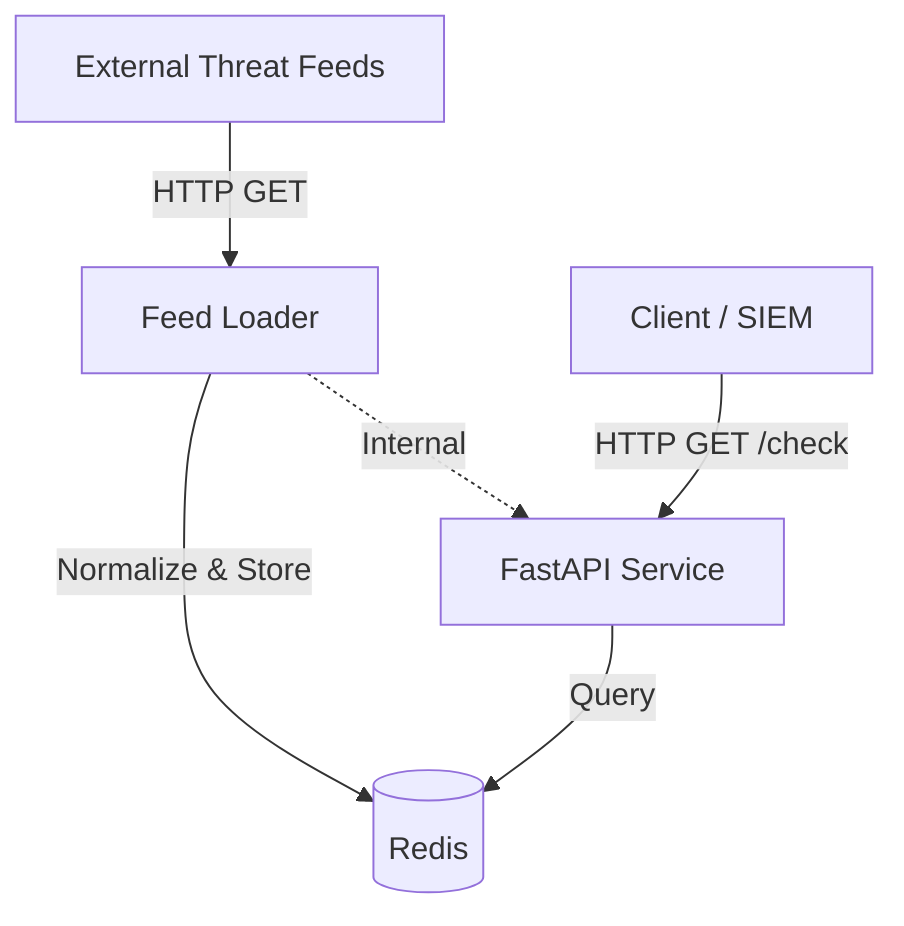
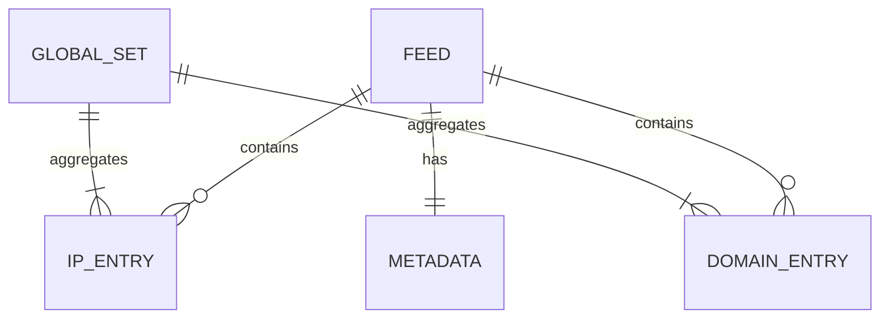

# ThreatBridge Codebase Context

## 1. Overview
ThreatBridge is a lightweight threat intelligence aggregator and lookup service. It downloads text-based threat feeds (IPs and domains), normalizes them, stores them in Redis, and exposes a low-latency HTTP API for reputation lookups. It is designed to sit between threat feeds and consumers (like SIEMs or firewalls).

- **Primary Language:** Python 3.11
- **Key Frameworks:** FastAPI, Redis-py, Pydantic, httpx
- **Architecture:** Monolithic API with background scheduler + Redis backing store
- **Repository Structure:** Source code in `source/src`, deployment configs in root and `deploy/`



## 2. Repository Map

### Directory Structure
```
.
├── source/
│   ├── config/             # Configuration files
│   ├── src/                # Application source code
│   │   ├── config.py       # Configuration loading & Pydantic models
│   │   ├── loader.py       # Feed downloading & processing logic
│   │   ├── metrics.py      # Prometheus metrics definitions
│   │   ├── models.py       # API response & internal data models
│   │   ├── psl_classifier.py # IP/Domain classification logic
│   │   ├── redis_client.py # Redis wrapper & data access layer
│   │   ├── ti_api.py       # FastAPI application entry point
│   │   └── static/         # Frontend static assets
│   └── docs/               # Documentation
├── deploy/                 # Deployment variations
├── Dockerfile.api          # Main application container image
├── Dockerfile.loader       # Standalone loader container image
└── docker-compose.yml      # Local development stack
```

### Key Files
- `source/src/ti_api.py`: Main entry point. Initializes FastAPI, Scheduler, and defines endpoints.
- `source/src/loader.py`: Core business logic for fetching, parsing, and updating feed data.
- `source/src/redis_client.py`: Handles all Redis interactions, including atomic swaps and set operations.
- `source/src/psl_classifier.py`: Domain/IP validation and "walkable" domain detection (eTLD+1).

## 3. Runtime Architecture

### Services
- **API Service (`source/src/ti_api.py`):**
  - Serves HTTP traffic.
  - Runs an `AsyncIOScheduler` to periodically trigger feed reloads (default: every 60m).
  - Can perform an initial feed load on startup.
- **Redis Service:**
  - Primary data store.
  - Holds Sets for IPs/Domains and Hashes for metadata.
- **Optional Loader (`source/src/loader.py`):**
  - Can run as a standalone container/job to update feeds independently of the API.

### Data Flow (Ingestion)
1. **Trigger:** Schedule or API startup.
2. **Download:** `FeedLoader` streams content from feed URLs.
3. **Parse:** Content is split into lines; comments skipped.
4. **Classify:** `PSLClassifier` determines if entry is IP, CIDR (expanded), or Domain.
5. **Stage:** Entries are written to temporary Redis sets (`:new`).
6. **Swap:** `RedisClient` atomically swaps staging sets to live sets.
7. **Rebuild:** Global union sets (`ti:all:ips`, etc.) are rebuilt for fast O(1) lookups.

## 4. APIs & Contracts

### Public Endpoints
- `GET /check/ip?ip={ip}`: Check IP reputation.
  - Returns `CheckResult` (found, risk, feeds).
- `GET /check/domain?domain={domain}`: Check Domain reputation.
  - Checks exact match and "walkable" parent match.
  - Returns `DomainCheckResult`.
- `GET /feeds`: List all configured feeds and their status.
- `GET /feeds/{feed_name}`: Detailed stats for a specific feed.
- `POST /feeds/{feed_name}/refresh`: Trigger manual refresh (Rate limited).
- `GET /metrics`: Prometheus metrics.
- `GET /health`: System health status.

### Internal Signals
- **Scheduler:** `apscheduler` triggers `scheduled_feed_load()` coroutine.

## 5. Domain Model

### Configuration (`source/src/config.py`)
- **FeedConfig:** Defines a source.
  - `name`: Unique identifier (Redis key prefix).
  - `url`: Source URL (supports env var injection).
  - `risk`: `high`, `medium`, `low`.
  - `refresh_minutes`: Optional override for global interval.

### Data Models (`source/src/models.py`)
- **FeedMetadata:** Stored in Redis (`ti:feed:{name}:meta`). Tracks load stats, timestamps, hashes.
- **CheckResult:** API response format.
  - `found`: boolean.
  - `risk`: Aggregated highest risk from matching feeds.

### Entity Relationship


## 6. Control Flow & Key Use Cases

### IP Lookup Flow
1. **Request:** `GET /check/ip?ip=1.2.3.4`
2. **Validation:** `psl_classifier.is_ip_address()` validates format.
3. **Global Check:** `redis_client.sismember("ti:all:ips", ip)` provides O(1) existence check.
4. **Detail Resolution:** If found, iterate configured feeds to find specific sources via `sismember("ti:feed:{name}:ips", ip)`.
5. **Risk Calculation:** Compute highest risk level from matching feeds.
6. **Response:** JSON result.

### Domain Lookup Flow
1. **Request:** `GET /check/domain?domain=foo.example.com`
2. **Exact Match:** Check `ti:all:domains`.
3. **Walkable Match:** If not exact, extract eTLD+1 (`example.com`) and check `ti:all:domains:walkable`.
4. **Resolution:** Identify source feeds from either exact or walkable sets.

## 7. Configuration & Environments

### Configuration Sources
1. **Environment Variables:**
   - `REDIS_HOST`, `REDIS_PORT`, `API_PORT`.
   - `FEEDS_CONFIG`: Path to YAML config (default `/config/feeds.yml`).
2. **YAML Config (`feeds.yml`):**
   - Defines list of feeds.
   - Global settings (`reload_interval_minutes`, `min_cidr_prefix`).

### Secrets
- Secrets (like API keys) are injected into Feed URLs via config interpolation: `url: "from env var: MY_FEED_KEY"`.

## 8. Persistence & Caching

### Redis Schema
- **Sets:**
  - `ti:feed:{name}:ips`: IPs for a feed.
  - `ti:feed:{name}:domains`: Exact domains.
  - `ti:feed:{name}:domains:walkable`: eTLD+1 domains.
  - `ti:all:ips`: Union of all feed IPs.
  - `ti:all:domains`: Union of all exact domains.
  - `ti:all:domains:walkable`: Union of all walkable domains.
- **Hashes:**
  - `ti:feed:{name}:meta`: Metadata (timestamps, counts, errors).
- **Keys:**
  - `ti:ratelimit:refresh:{name}`: TTL key for rate limiting manual refreshes.

### Data Lifecycle
- **Updates:** Feed data is replaced fully on every load (Atomic Swap).
- **Staging:** New data loads into `:new` keys before swapping.
- **TTL:** No TTLs on data sets; they persist until next load or explicit deletion.

## 9. Observability

### Logging
- Standard Python `logging`.
- Format: `%(asctime)s - %(name)s - %(levelname)s - %(message)s`.
- Levels controlled via `LOG_LEVEL` env var.

### Metrics (Prometheus)
- **Endpoint:** `/metrics`
- **Key Metrics:**
  - `ti_feed_entries_total`: Gauge, labeled by feed and type.
  - `ti_lookup_requests_total`: Counter, labeled by endpoint and result.
  - `ti_lookup_duration_seconds`: Histogram, latency.
  - `ti_feed_last_load_timestamp`: Gauge.

## 10. Testing
- **Status:** No automated tests present in the repository.
- **Validation:** `psl_classifier` contains regex and logic validation for inputs.

## 11. Build & Release
- **Docker:**
  - `Dockerfile.api`: Python 3.11-slim, installs requirements, runs gunicorn/uvicorn.
  - `Dockerfile.loader`: Standalone script runner.
- **CI/CD:** `.github/workflows/dockerghcr-publish.yml` (implied from file presence) handles build/publish.

## 12. Operational Notes
- **Startup:** API attempts to load all feeds on startup unless `SKIP_STARTUP_LOAD=true`.
- **Memory:** `gunicorn` configured with `--preload` to share memory.
- **Concurrency:** `load_all_feeds` runs async but CPU-bound parsing happens in event loop (potential blocker for high load, though mitigate by async sleep in I/O).

## 13. Glossary
- **Walkable Domain:** A domain that is a "registrable domain" (eTLD+1, e.g., `google.com`), allowing subdomains (e.g., `mail.google.com`) to match against it during lookups.
- **Feed:** A named source of threat intelligence data (URL returning text list of indicators).
- **Global Set:** A Redis set containing the union of all indicators from all enabled feeds, used for fast O(1) existence checks.
